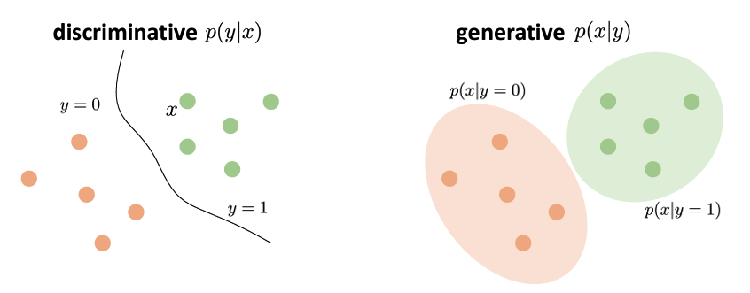
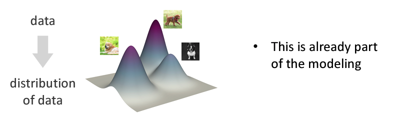
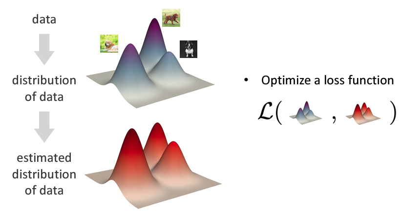
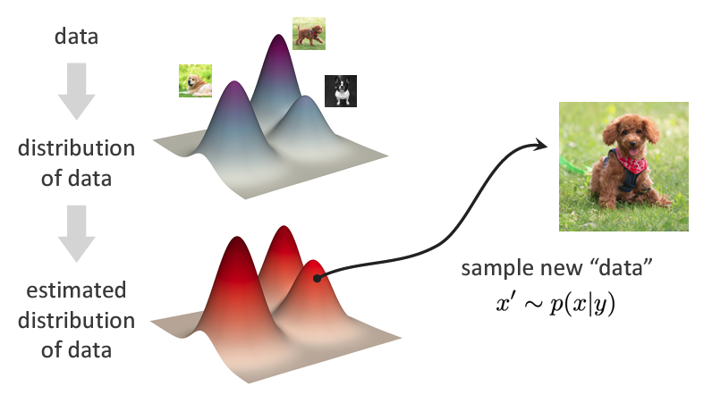

# Deep Generative Models

!!! abstract
    生成式模型被广泛应用于图像生成、文本生成、语音生成等领域，我在25年初（寒假）开始进行这部分的学习，主要参考的是Stanford CS236 课程和MIT 6.S987 课程的讲义

    进行这部分学习的初衷是在侯老师的实验室，我在秦睿师兄的指导下开展关于蛋白质分子生成工作的评测，由于不想局限于使用现有模型而是能更深入的理解模型的工作原理，因此开始进行这部分的学习。

## Intro

我们说生成式模型（Generative Model），与之相对的是判别式模型（Discriminative Model）：

- Discriminative：

    sample $x \rightarrow$ label $y$

    只有一个期望输出

- Generative：

    label $y \rightarrow$ sample $x$

    有多个期望输出

并且利用贝叶斯公式我们可以由生成式模型的概率得到判别式：

$$
p(y|x) = \frac{p(x|y)p(y)}{p(x)}
$$

但是反之并不能很好的成立：

    

因为我们需要知道数据sample的分布，但是只有生成式概率$p(x|y)$，而$p(x)$是不知道的。

!!! note "总结"

    生成式模型就是要去寻找数据的潜在分布$p(x)$，来生成与真实数据分布相似的样本

## Probabilistic Modeling

前文中我们提到了一系列概率$p$，但是这些概率是哪里来的呢？

!!! Tip "Hint"
    

        
            Probability is part of the modeling.
        
    

怎么理解这句话呢，我的理解就是我们在学习时，其实就是在学习一种概率分布，对观测的数据进行建模，所以其实得到的分布函数就是我们的模型。

这样说有点抽象，试着举个例子：

我们以生成式模型为例，采用概率建模的方法：

???+ example "Image Generation"

    - 我们的目标是通过给定的一些图像，生成一个新的图像

    
    
    - 在通过一系列的方法，得到一个估计（estimated）的分布，这个分布的评估是通过损失函数$L$来进行的
  
    

    - 此时我们依照给定特征$y$，生成一个图像$x'$，这个$x'$就遵从我们得到的分布$p(x|y)$

    

!!! note "Notes"
    
    - Generative models involve statistical models which are often designed and derived by humans.
    - Probabilistic modeling is not just work of neural nets.
    - Probabilistic modeling is a popular way, but not the only way.

## "Deep" Generative Models

深度学习是一种表征学习，也就是说我们学习的是如何将数据 $x$ 映射到$f(x)$，使得损失函数$L(f(x), y)$最小。

在深度生成模型的学习中，我们学习的是如何表征概率分布

    

这里我们学习得到一个简单分布到复杂分布的映射，这个映射就是我们的模型。

$$
 \pi \rightarrow g(\pi)
$$

随后最小化基于数据的损失函数$L(p_x , g(\pi))$，得到模型$g$