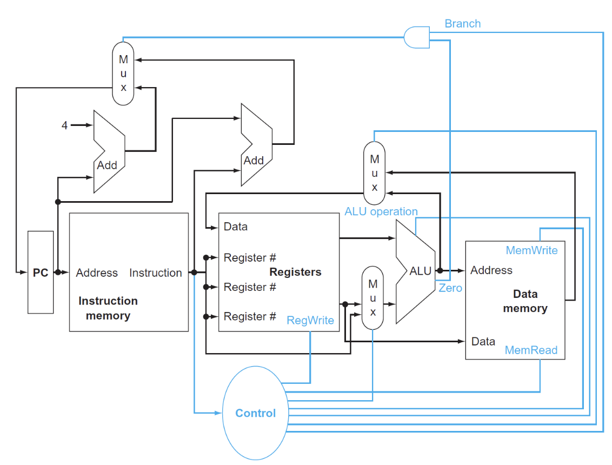

## Single-Cycle Processor

### Intro

指令执行的步骤概述：

- 最开始的两步是相同的：

1. Fetch 从指令内存中拿出指令
   
  
2. Decode and Read Operands 解码并读寄存器
     - 在进行指令解码完成前就可以读取数据，因为数据位置是固定的，并且读数据不会破坏数据，所以无论是否使用，都会先拿出对应的register operands。

3. Executive Control

    所有的指令都会经过ALU，根据指令的类型进行不同的ALU操作：

    
    - 内存引用指令：Memory Reference 
    - 算术逻辑指令：Arithmetic and Logic 
    - 条件分支指令：判断两数是否相等

4. Memory Access 
 
    通过load和store指令访问数据

    - 内存引用指令：访问内存进行读写
    - 算术逻辑指令/加载指令：将内存或者寄存器中的数据写入寄存器
    - 条件分支指令：根据比较结果更新PC：PC+4 或到指定目标地址

5. Write results
    
6. Update PC

!!! note "simple processor"

    

    三个红色圆圈是多路选择器，因为需要对不同的数据来源进行选择，比如ALU中的输入既可以是R型指令中的两个源寄存器，也可以是I型指令中的一个源寄存器和一个立即数。

!!! note "with control"

    


### Clock Methodology

### Datapath

构建数据通路时，我们关心的是指令中的存储数据而不是控制信号。

#### Instruction Fetch

<div align="center">

</div>

64bit寄存器，需要64个D触发器。

#### R Inst

<div align="center">

</div>

- Register File: 寄存器堆，用于存储所有寄存器
    - 进行选择的wire是5位，因为寄存器有32个。
    - 读取数据只需要进行选择（在R型指令前已经有ld指令将数据写入寄存器），写入数据需要受`RegWrite`信号控制  
- ALU: 进行算术逻辑运算
    - 有一个四位的MUX进行控制，但事实上只需要三位，有一位是浪费的（但我们必须使用四位，因为MUX的输入端口数必须是2的幂次）
  
#### Load Store Inst

除了R型指令用到的两个元件，还需要两个

<div align="center">

</div>

- Data Memory: 数据内存,不同于Register File，Data Memory同时具有读写控制
    - 读取数据ld需要受`MemRead`信号控制，写入数据sd需要受`MemWrite`信号控制
        - 内存的读取需要控制信号的原因是：并不是所有指令都会有访存操作，所以那些用不到内存值的指令就没必要读取内存数据，因此需要控制信号来关闭这扇门；而所有指令都要从寄存器堆里读取数据，因此寄存器堆的读取无需控制信号
- Imm Gen: 从 32 位指令中提取出与立即数相关的位，将这些位按正确的顺序拼接起来，同时对其符号扩展至 64 位

#### Branch Inst

这里只考虑了beq指令


<div align="center">

</div>

- 寄存器用于存放两个被比较的源操作数，进入ALU进行比较
- ALU：第一个ALU的作用是进行比较，并且有一个zero用于判断是否相等进而选择PC+4还是branch target address；第二个ALU只有加法，用于计算branch target address
- Shift left 1:根据之前学到的，在进行branch target address计算时，我们所需的offset在立即数中是真实值的一半，因此对于Imm Gen输出的立即数，我们需要进行左移一位的操作乘2

#### Compose

- 每个数据通路都是单周期的

!!! note "datapath"

    

??? note "All types' datapath"

    === "R-type"

        

        R-type 的指令是完全建立在Register File上的，没有与内存的交互，使用R指令一定是在内存读取后进行的。

    === "I-type"

        

    === "S-type"

        

    === "B-type"

        


    === "J-type"

        

### Control Unit

只有7+4根信号

实际上只需要处理八个信号

!!! note "8 signals"

    


##### ALU Control

ALU的控制信号一共有4位：

- 其中2位分别来自funct3和funct7
- 另外2位是来自ALUop，它来自主控制单元 (main control unit)，用于指定具体执行何种指令，不同的值对应不同的类型：
    - 00：加载/存储指令
    - 01：条件分支指令
    - 10：R型指令
    - 11：I型指令（addi andi）好像会用到？

??? note "ALU control"

    | Instruction opcode | ALUOp | Operation | Funct7 | Funct3 | Desired ALU action | ALU control Input |
    |-------------------|--------|-----------|---------|---------|-------------------|------------------|
    | ld | 00 | load doubleword | XXXXXXX | XXX | add | 0010 |
    | sd | 00 | store doubleword | XXXXXXX | XXX | add | 0010 |
    | beq | 01 | branch if equal | XXXXXXX | XXX | subtract | 0110 |
    | R-type | 10 | and | 0000000 | 111 | AND | 0000 |
    | R-type | 10 | or | 0000000 | 110 | OR | 0001 |
    | R-type | 10 | add | 0000000 | 000 | add | 0010 |
    | R-type | 10 | sub | 0100000 | 000 | subtract | 0110 |
    | R-type | 10 | slt | 0000000 | 010 | slt | 0111 |
    | R-type | 10 | srl | 0000000 | 101 | srl | 0101 |
    | R-type | 10 | xor | 0000000 | 011 | xor | 0011 |


采用两级解码，根据opcode就可以判断7根信号线的值，这时候 ALU 再看funct3和funct7就可以判断出剩下的4根信号线的值。


##### Main Control Unit

余下的六个控制信号的作用如下：


- ALUSrc: 决定ALU的第二个输入，0时从寄存器堆中读取数据，1时从立即数中读取数据
- PCSrc: 决定PC的值，0时选择PC+4，1时选择branch target address
- MemtoReg: 00时将ALU的结果返回给目标寄存器，01时将内存中的数据返回给目标寄存器，


最终：


----

##### Operation of Datapath

> 灰色的元件代表没有被使用

=== "R-type"

    
    <div align="center">
    
    </div>

    ```asm
    add x1, x2, x3
    ```

    1. IF：取指，递增PC
    2. ID：解码，从寄存器堆中读取寄存器
    3. EX：执行，ALU根据操作码确定运算类型，然后对上一步的数据进行计算
    4. MEM：无
    5. WB：写回，将结果写入x1

=== "L/S-type"

    <div align="center">
    
    </div>

    ```asm
    ld x1, offset(x2)
    ```

    1. IF：取指，递增PC
    2. ID：从寄存器堆中读取x2
    3. EX：ALU计算x2的数据和经过imm符号扩展的offset的和，得到内存地址
    4. MEM：根据地址得到对应数据
    5. WB：将数据写入x1

=== "B-type"

    <div align="center">
    
    </div>

    ```asm
    beq x1, x2, offset
    ```

    1. IF：取指，递增PC
    2. ID：从寄存器堆中读取x1和x2
    3. EX：ALU将两个读取的数据相减，同时将PC与左移一位后的offset相加，得到branch target address，根据ALU的zero信号判断如何更新PC

## Pipelining Process

流水线Pipeline的本质是提高吞吐量，通过将指令的执行过程分解为多个阶段，每个阶段在不同的时钟周期内执行，从而在每个时钟周期内完成多条指令的执行。

在RISC-V中，流水线Pipeline的实现方式是：

- IF: Instruction Fetch 从指令内存中取出指令
- ID: Instruction Decode 解码指令
- EX: Execute 执行指令
- MEM: Memory Access 访问内存
- WB: Write Back 写回寄存器

!!! example "pipeline"

    

    <span style="font-size: 1.1em">
        图形左半边阴影是写入，右半边阴影是读取，全阴影是都有（这里假设在一个时钟周期内，元件的前半个周期可以进行写操作，后半个周期可以进行读操作）
    </span>
    
    !!! note "寄存器读写"
        注意到对于寄存器的读写操作，只占用时钟周期的一半，但是ID和WB的完成分别是在一个时钟周期的前后两个部分，只是因为有时对寄存器的操作是同时进行的，为了避免冲突，所以才将ID和WB的完成时间错开，这一操作是通过将读写的操作分别由clk的上升沿和下降沿完成实现的

    ??? example "comparison example"
        <span style="font-size: 1.1em">
            在规定好每个部件所需要的时间后，我们可以对单周期CPU和流水线CPU的执行指令时间进行比较
        </span>

        

        执行：
        ```asm
        ld x1, 100(x4)
        ld x2, 200(x4)
        ld x3, 400(x4)
        ```

        

        <span style="font-size: 1.1em">
            单周期CPU的时钟周期是取决于最长指令的时间，因此在这里时钟周期就是800ps，执行3个ld指令需要2400ps
        </span>

        <span style="font-size: 1.1em">
            流水线CPU的执行是分阶段的，时钟周期取决于最长的阶段，在这里是200ps，reg操作虽然只用100ps，但是仍然需要进行200ps的操作，最终需要7 * 200ps = 1400ps
        </span>

但是不是所有指令都需要执行所有阶段的指令的，比如load和store指令就不需要执行EX和MEM阶段。

性能方面：理想条件下

$$
\text{Time between instructions}_{pipelined} = \frac{\text{Time between instructions}_{non-pipelined}}  {\text{Number of stages}}
$$

!!! warning "时钟周期"
    <span style="font-size: 1.1em">
        流水线CPU的时钟周期 = 耗时最长的阶段所花的时间
    </span>


- 只有当每个阶段的时间相等的理想情况发生，才会有上述的性能提升
- 同时对于Latency，每个指令是不减的

!!! success 
    Pipeline 是通过增加通量（throughput）来提高性能的，而不是减少Latency


### Hazards

Harzard（竞争）：

是指由于某种原因指令无法按照预期顺序继续执行，分为以下三种：

- Structure Hazards
    - 需要的资源被占用，导致指令无法继续执行
    - 如多条加载存储指令在同一个时钟周期内对同一块内存进行访问


- Data Hazards
    - 需要等待上一条指令完成数据写入或者读取完成才能进行后续操作
    - 解决方案：添加额外的硬件**前递**（forwarding）或称为**旁路**（bypassing）
    
    <div align="center">
    
    </div>

    只有当目标阶段比源阶段晚时，才能进行前递

    - 这一情况对于R型指令是适用的，但是如果先执行加载指令，后执行依赖于该加载指令数据的指令，即使加了一个前递，CPU 还是不得不暂停一个时钟周期，这种情况称为**加载使用数据冒险**(load-use data hazard)，如下图所示：
    
    <div align="center">
    
    </div>

    中间的气泡称为流水线停顿（pipeline stall）或者bubble
    
    这种情况我们可以通过软件层面的优化来解决：

    ??? example "顺序调整"
        ```c
        a = b + c;
        c = b + f;
        ```

        得到一个自然的汇编代码：

        ```asm hl_lines="2-3 5-6"
        ld  x1, 0(x31)
        ld  x2, 8(x31)
        add x3, x1, x2
        sd  x3, 24(x31)
        ld  x4, 16(x31)
        add x5, x1, x4
        sd  x5, 32(x31)
        //我们可以看到高亮的两组代码都发生了load-use data hazard，需要增加两个stall
        ```

        ```asm hl_lines="3"
        ld  x1, 0(x31)
        ld  x2, 8(x31)
        ld  x4, 16(x31)
        add x3, x1, x2
        sd  x3, 24(x31)
        add x5, x1, x4
        sd  x5, 32(x31)
        //因为在这里我们提前了f的读取，正好给了b读取指令时间，所以不需要增加stall了
        ```

        

        这种计算也是要掌握的，需要自己判断是否加入stall


    


- Control Hazards
    - 需要决定的控制信号依赖于先前的指令，导致无法确定下一条指令的执行
    - 解决方案：将寄存器的比较和目标地址的计算提前到ID阶段
    - 但是这样仍然会有一个bubble的产生：

    <div align="center">
    
    </div>
    
    - 我们需要一个更好的解决方法：**分支预测**：
    - 一种方法是**静态预测**
        - 无论什么条件都进行跳转，如果成功则继续进行，如果失败就撤回错误指令，这需要一个额外的时钟周期，效果就和插入bubble一样了，这样至少提高50%效率
    - 另一种方法是**动态预测**


### DataPath in Pipeline

根据指令执行的阶段，将先前的datapath进行划分：


大多数情况下，指令执行的顺序都是从左到右，但是也有例外：

- 最后的写回阶段，将内存的数据写入寄存器是从右往左的（可能会导致数据冒险）
- PC寄存器的输入数据（两种选择）是从右往左传递给PC选择MUX的（可能会导致控制冒险）

- 在流水线中我们需要储存进入执行的指令，因此需要一个额外的寄存器，叫做**流水线寄存器**，位于两个阶段之间

<div align="center">

</div>

!!! example "ld process of pipeline"

    === "IF"

        

        - 将PC寄存器的指令地址传给IF/ID流水线寄存器，供下一条指令使用
        - 同时传递指令内容
  
    === "ID"

        

        - 除了继续传递指令地址，还要传递寄存器堆的数据和立即数
    
    === "EX"

        

        - 将计算好的内存地址放入EX/MEM
    
    === "MEM"
        
        

        - 从EX/MEM读取内存地址，然后将对应的内存数据写入MEM/WB
    
    === "WB"

        

        - 从MEM/WB读取内存数据，然后将数据写入寄存器
        
        !!! note "save register number"
            在最后写回数据时，我们的指令中已经没有需要写回的寄存器编号了，所以我们改进了这个设计，将寄存器编号放在流水线寄存器中，这样在WB阶段就可以直接使用


### Control in Pipeline

在单周期CPU中我们引入了一系列控制信号来进行控制，在这里流水线CPU也需要控制指令，并且这些控制指令也是随着流水型寄存器的传递而传递的


<div align="center">

</div>

可以看到控制信号随着流水线的进行逐渐被使用，被使用的信号将不再被传递，节约了空间


在加入控制器后：


### Data Harzards Fixing 

data hazard的解决方法有两种，一种是进行前递forwarding，另一种是进行停顿stall

#### Forwarding

```asm
sub x2, x1, x3
and x12, x2, x5
or  x13, x6, x2
add x14, x2, x2
sd  x15, 100(x2)
```

画出流水线图：

<div align="center">

</div>

图中下方四个蓝色的寄存器是需要前递数据的寄存器，在正常情况下，我们得到最终的x2数值是在MEM/WB阶段，也就是图中所示第一个蓝色寄存器，但是显然上方的两个需要x2寄存器数值的指令无法前递，而我们在EX阶段其实已经得到了x2的数值，因此我们可以将x2的数值前递给上方两个指令


<div align="center">

</div>

我们观察到两个前递的发生：

- "1"型是相邻的前递：

$$
\text{EX/MEM.RegRd} \rightarrow \text{ID/EX.RegRs1(Or Rs1)}
$$

- "2"型是相邻两个指令之间的前递：

$$
\text{MEM/WB.RegRd} \rightarrow \text{ID/EX.RegRs2(Or Rs2)}
$$

!!! note "前递的判断"
    除了上述两个判断，还需要补充一些判断条件

    - 并不是所有指令都包含写入寄存器的操作，所以提前检测```RegWrite```信号是否为1，不是的话直接不用前递
    - 如果目标寄存器的数值是0，我们不希望进行前递，因为0值的寄存器没有任何意义
    
    - 同样还需要注意的是dubble data harzard，如果连续三条指令都在使用同一个寄存器，那么我们只需要对最新的指令进行前递，例如下面的指令：

    ```asm
    add x2, x2, x3
    add x2, x2, x4
    add x2, x2, x5
    ```
    我们需要增加一个判断，就是下方伪代码的高亮部分

最终我们可以将整个forwarding unit的逻辑写成一个大的判断模块：

```java hl_lines="10"
//For EX to ID
if (EX/MEM.RegWrite == 1 and EX/MEM.RegRd != 0)
    if (EX/MEM.RegRd == ID/EX.RegRs1)
        ForwardA = 10
    if (EX/MEM.RegRd == ID/EX.RegRs2)
        ForwardB = 10

//For MEM to ID
if (MEM/WB.RegWrite == 1 and MEM/WB.RegRd != 0)
    and not (EX/MEM.RegWrite == 1 and (EX/MEM.RegRd == ID/EX.RegRs1 or EX/MEM.RegRd == ID/EX.RegRs2))
    if (MEM/WB.RegRd == ID/EX.RegRs1)
        ForwardA = 01
    if (MEM/WB.RegRd == ID/EX.RegRs2)
        ForwardB = 01
```

我们在这段判读中使用了```ForwardA```和```ForwardB```来表示前递的类型，其实就是添加一个Mux来选择ALU的输入位置是A还是B

<div align="center">

</div>


这样我们就得到了完整的datapath：

<div align="center">

</div>

#### Stalling

先前我们讲到过，当发生load-use data hazard时，我们需要进行停顿，也就是插入stall，这是为什么呢？

!!! example "load-use data hazard"
    <div align="center">
    
    </div>
    
    可以看到在ld指令得到数据的位置是在MEM/WB阶段，这样我们就不能在ALU计算出结果（imm + x1 的地址）后的直接拿出，因为ALU的计算结果地址从内存中读取的数据才是x2的值

    这时无论怎样前递都达不到目的，只能添加一个stall


给出判断条件：

```java
if (ID/EX.MemRead == 1 and (ID/EX.RegRs(1 or 2) == IF/ID.RegRd))
stall pipeline 
```

- 我在学习这里时并没有很理解，因为在上面的示例中，我们是看到了ld指令执行结束后的情况，但其实在ld指令执行到ID/EX阶段时，add指令就已经译码完成了，我们在CC2-CC3这个时刻就已经要进行判断

这样我们stall后的流水线进程就变为了：

<div style="display: flex; justify-content: center;">
    
    
</div>

hygg的作业题中这张图片不错，对齐的是每个指令阶段，这样就很容易看出stall的插入位置，向hygg学习（）

接下来我们来解决怎么进行stall：

- 停止IF：不能改变PC寄存器的数值（进行重复读取），所以要为 PC 寄存器添加写信号 ```PCWrite```
- 停止ID：不能改变 IF/ID 流水线寄存器的值（读取重复的值）所以要为该寄存器添加写信号 ```IF/IDWrite```
- 确保空操作nops：保证流水线不改变状态，需要让所有的控制信号为0（实际上只需要```RegWrite```和```MemWrite```为0，其他无所谓）


### Control Hazards Fixing


如图，在beq指令中，我们正常情况下需要在WB阶段才能知道beq指令的执行结果，这之中会有三个指令的执行（被浪费），因此分支指令的优化是很重要的

<div align="center">

</div>

- 一个思路是：Calculate in advance

正常情况下用ALU来计算出beq指令的地址，但实际上在ID阶段已经有imm和x1的值了，所以我们在ID阶段后增加一个专门的分支加法器就可以提前算出，可以减少两个指令的浪费

=== "1"

    

=== "2"

    


- 一个更好的思路是：Branch Prediction，有两种
    - Static Prediction
    - Dynamic Prediction

静态预测就是一直认为自己跳转或者不跳转，动态预测则是根据历史情况进行判断

1-bit predictor：

用0 1来区别上次的分支指令是否发生跳转，如果预测失败，反转这个bit。

2-bit predictor：

相当于只有连续两次判断错误才会更改判断，可以优化while loop的犯错次数

<div align="center">

</div>


