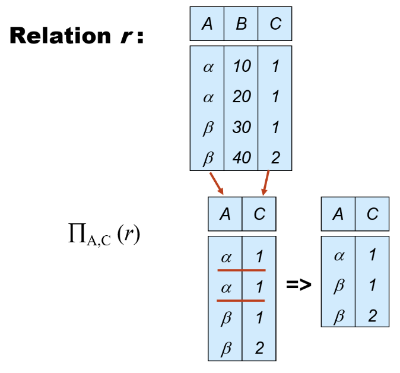

# Database System

!!! abstract "摘要"
    
    这是我在学习数据库系统时的memo，我不会系统的整理整个课程的笔记，但是会写下一些备忘和例子方便复习时使用

## Relational Model

- 关系的定义最基本是集合，集合是没有重复元素的

mutiset 是允许重复元素的

- Union 中要求：
    - 两个集合的arity相同（same number of attributes）
    - attribute domains 是要compatible的，不是说完全相同，但是要类似

- Rename：
    
    重命名中的E不一定是关系，也可以是表达式

- Natural Join:

    没有增加表达能力但是简化了操作，

